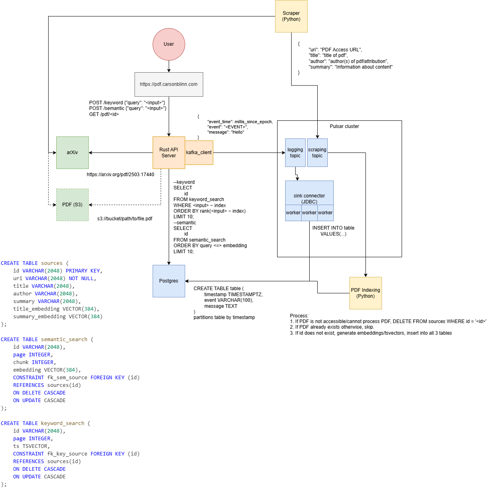

# Book Search Project

This is a project to provide keyword and semantic search indexing over educational materials--instead of needing to find a specific resource and then read through it to find relevant information, storing just keyword/semantic information in a database and then retrieving the resource from its underlying source would allow some reduction in data volume, and continue to support the underlying websites.

This would also be a very useful format for AI systems, and could handle cases where the AI systems need to be billed when pulling certain information.

## Architecture

## Notes

* First iteration is available at [pdf.carsonblinn.com](https://pdf.carsonblinn.com). This is an earlier iteration and only includes keyword search on a few computer science documents. Running on a single raspberry pi, so GPU acceleration and storage for larger data volumes is lacking.
* Next iteration will include a Pulsar cluster and data ingestion pipeline, to start to increase the data volume and stack database writes into an asychronous queue.
* OpenDAL also allows for easy data access that can be streamed across an API call to an end user, which will allow many data formats to be consumed through the API.
* Also would be useful to provide cookies in the browser that save users' favorite PDFs and locations, etc.